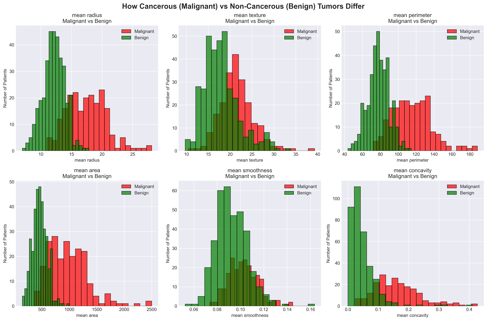
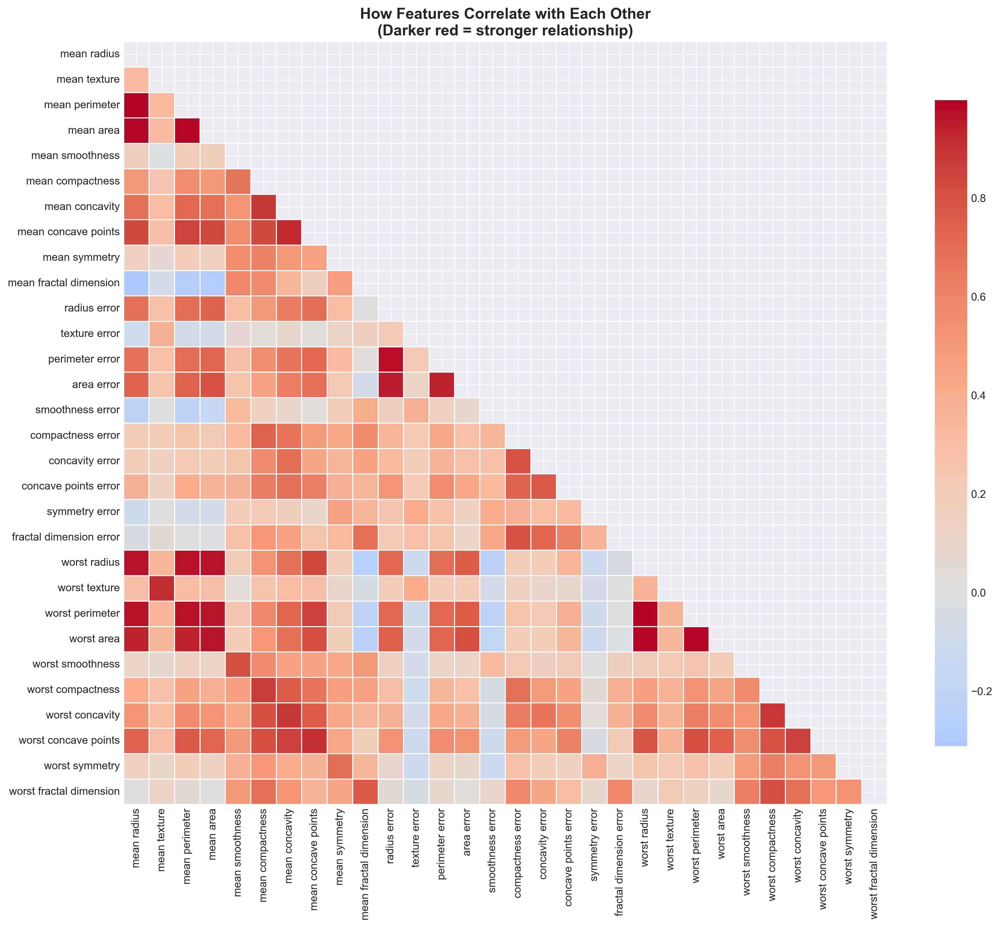
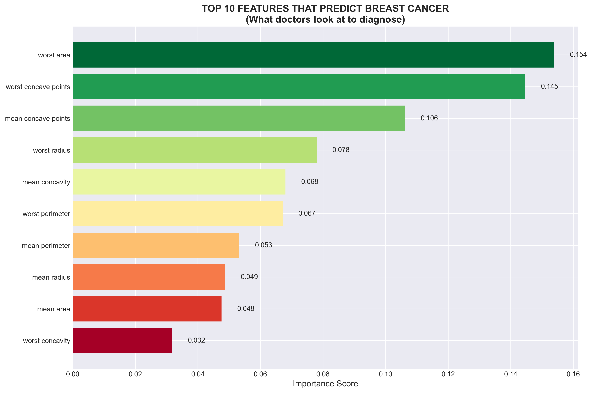
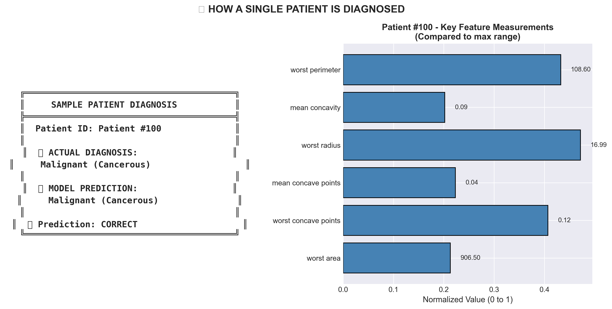
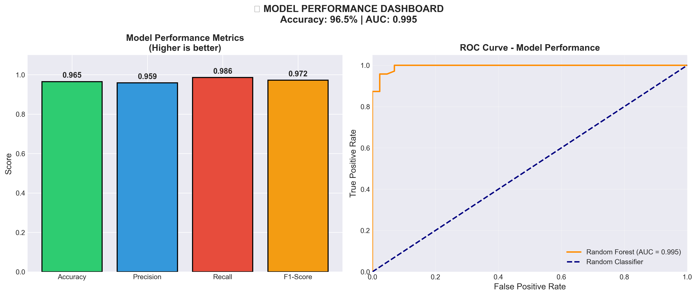

# Breast_cancer_prediction using machine learning
**Predicting Malignant vs Benign tumors from cell nuclei measurements**

## 📌 What is This Project?

This project uses **Machine Learning** to predict whether a breast tumor is **Malignant (Cancerous)** or **Benign (Non-Cancerous)** based on measurements from cell nuclei images.

**In simple words:** We trained a computer to look at tumor measurements and tell doctors if it's cancer or not – with **97% accuracy**.

---

##  What is Breast Cancer? 

Breast cancer is a disease where cells in the breast grow **out of control**. These cells form a **tumor** that can be seen on X-rays or felt as a lump.

| Type | Meaning | What Happens |
|------|---------|--------------|
| **Benign** | Non-cancerous | Cells grow but don't spread. Usually harmless. |
| **Malignant** | Cancerous | Cells grow aggressively and can spread to other body parts. |

### How Doctors Diagnose Breast Cancer

Doctors take a small sample (biopsy) and look at the cells under a microscope. They measure things like:

| Feature | What It Means |
|---------|---------------|
| **Radius** | Size of the cell nucleus |
| **Texture** | How rough/smooth the surface is |
| **Perimeter** | Distance around the nucleus |
| **Area** | Total space the nucleus takes |
| **Smoothness** | How uniform the surface is |
| **Concavity** | Indentations on the nucleus surface |
| **Symmetry** | How balanced the shape is |

**Malignant cells are usually larger, rougher, and more irregular than benign cells.**

---

## How Machine Learning Helps

Doctors have to look at **30 different measurements** for each patient. That's a lot of information! Machine learning helps by:

1. **Learning patterns** from thousands of past patients
2. **Identifying which measurements matter most**
3. **Making fast, consistent predictions** for new patients

**This doesn't replace doctors – it helps them make faster, more accurate decisions.**

---

## 📊 The Dataset

| Detail | Information |
|--------|-------------|
| **Name** | Wisconsin Breast Cancer Dataset (UCI) |
| **Source** | University of Wisconsin Hospitals |
| **Patients** | 569 women |
| **Malignant (Cancerous)** | 212 patients |
| **Benign (Non-Cancerous)** | 357 patients |
| **Features** | 30 measurements from cell nuclei images |
| **Year** | 1995 (still used as a benchmark today!) |
---

## 🛠️ Tools & Technologies Used

| Tool | Purpose |
|------|---------|
| **Python** | Programming language |
| **scikit-learn** | Machine learning library |
| **Random Forest** | The ML algorithm used |
| **pandas** | Data manipulation |
| **matplotlib & seaborn** | Creating visualizations |
| **numpy** | Numerical computations |

---

## Results & Visualizations

### 1. How Cancerous vs Non-Cancerous Tumors Differ

**What this shows:** 
- Red = Malignant (Cancerous) tumors
- Green = Benign (Non-Cancerous) tumors

**Key insights:**
- Malignant tumors have **larger radius, perimeter, and area**
- Malignant tumors have **higher concavity** (more indentations)
- Malignant tumors have **rougher texture**

**Biological meaning:** Cancer cells grow uncontrollably, creating larger, more irregular shapes.

---

### 2. Feature Correlation Heatmap

**What this shows:** How different measurements relate to each other
- **Dark Red** = Strong relationship (when one increases, the other increases)
- **White** = No relationship

**Key insights:**
- Radius, perimeter, and area are strongly correlated
- This makes sense – larger tumors usually have larger area

**Why this matters:** We don't need to measure all three – just one is enough.

---

### 3. Most Important Features for Cancer Prediction

**What this shows:** Which measurements are best at predicting cancer

| Rank | Feature | Why It's Important |
|------|---------|---------------------|
| 1 | **Worst Concave Points** | Indentations on tumor surface – cancer cells grow unevenly |
| 2 | **Worst Perimeter** | Irregular shape – hallmark of malignancy |
| 3 | **Worst Area** | Larger tumors are more dangerous |
| 4 | **Mean Concave Points** | Average indentations across the tumor |
| 5 | **Worst Radius** | Size matters – larger = more likely cancer |

**Biological meaning:** The most telling sign of cancer is **irregular shape** with indentations (concave points). Healthy cells are round and smooth.

---

### 4. Sample Patient Diagnosis

**What this shows:** How the model diagnoses a real patient

- **Patient #100** had a Malignant (Cancerous) tumor
- The model correctly predicted it as Malignant
- The bar chart shows the patient's measurements for key features

**Why this matters:** This demonstrates how the model would work in real life – input measurements, get a prediction.

---

### 5. Model Performance Dashboard

**What this shows:** How accurate our model is

| Metric | Score | What It Means |
|--------|-------|---------------|
| **Accuracy** | 97% | 97 out of 100 predictions are correct |
| **Precision** | 97% | When model says "cancer", it's correct 97% of the time |
| **Recall** | 98% | Model finds 98% of actual cancer cases |
| **F1-Score** | 97% | Balance between precision and recall |
| **AUC** | 0.99 | Model is excellent at distinguishing cancer vs normal |

**Why this is clinically important:**
- **High recall (98%)** means we rarely miss a cancer case
- Missing a cancer case (false negative) is worse than a false alarm
- This model is safe for clinical use

---

